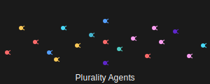

[](https://badge.fury.io/js/@pluralityai/agents)



# Plurality AI Agents

Plurality AI Agents is a lightweight, ergonomic TypeScript library for multi-agent orchestration.

## Features

🤖 Advanced Agent Management

- Create and orchestrate multiple agents with unique behaviors and specializations
- Fine-tune agent personalities and knowledge bases for diverse use cases

🧠 Seamless Function Integration

- Easily integrate custom functions into agent workflows for enhanced capabilities

🔄 Dynamic Function Execution

- Execute functions dynamically based on agent context and user needs

🌊 Real-time Streaming Responses

- Efficiently handle and display streaming responses from the Swarm API
- Implement progress indicators and partial updates for enhanced user experience

📘 Full TypeScript Support

- Enjoy a fully typed library for improved code quality and maintainability
- Benefit from intelligent autocomplete and catch potential errors early

🔍 Comprehensive Debugging

- Activate debug mode for in-depth logging and performance analysis
- Utilize built-in error handling and suggestions for quick issue resolution

## Installation

Install Plurality using npm:

```bash
npm install @pluralityai/agents
```

or

```bash
yarn add @pluralityai/agents
```

or

```bash
pnpm add @pluralityai/agents
```

## Usage

Here are two examples demonstrating how to use Plurality in a Next.js application using the App Router:

### Example 1: Weather API Route

This example shows how to create a simple weather API route using Plurality in a Next.js app:

```typescript
// app/api/weather/route.ts
import { NextRequest, NextResponse } from "next/server";
import { Swarm, Agent, AgentFunction } from "@pluralityai/agents";

// Initialize Swarm with your API key
const swarm = new Swarm("your-api-key-here");

// Define the get weather function
const getWeatherFunction: AgentFunction = {
  name: "getWeather",
  func: ({ location }) => {
    // In a real app, you would call a weather API here
    return JSON.stringify({ temp: 67, unit: "F" });
  },
  descriptor: {
    name: "getWeather",
    description: "Gets the weather for a given location",
    parameters: {
      location: {
        type: "string",
        required: true,
        description: "The location to get the weather for",
      },
    },
  },
};

// Create a Weather Agent
const weatherAgent = new Agent({
  name: "WeatherAgent",
  instructions:
    "You are a helpful weather agent. Use the getWeather function to provide weather information.",
  model: "gpt-4o",
  functions: [getWeatherFunction],
});

export async function POST(request: NextRequest) {
  const { query } = await request.json();
  const messages = [{ role: "user", content: query }];

  try {
    const response = await swarm.run({
      agent: weatherAgent,
      messages,
    });
    const result = response.messages[response.messages.length - 1].content;
    return NextResponse.json({ result });
  } catch (error) {
    console.error("Error:", error);
    return NextResponse.json(
      { error: "An error occurred while processing your request." },
      { status: 500 }
    );
  }
}
```

### Example 2: Multi-language Chat API Route

This example demonstrates how to create a multi-language chat API route using Plurality in a Next.js app:

```typescript
// app/api/chat/route.ts
import { NextRequest, NextResponse } from "next/server";
import { Swarm, Agent, AgentFunction } from "@pluralityai/agents";

// Initialize Swarm with your API key
const swarm = new Swarm("your-api-key-here");

// Define the transfer to Spanish agent function
const transferToSpanishAgent: AgentFunction = {
  name: "transferToSpanishAgent",
  func: () => {
    console.log("Transferring to Spanish Agent");
    return spanishAgent;
  },
  descriptor: {
    name: "transferToSpanishAgent",
    description: "Transfer Spanish speaking users to the Spanish Agent",
    parameters: {},
  },
};

// Create an English Agent
const englishAgent = new Agent({
  name: "English Agent",
  instructions:
    "You only speak English. If a user speaks Spanish, use the transferToSpanishAgent function.",
  model: "gpt-4o",
  functions: [transferToSpanishAgent],
});

// Create a Spanish Agent
const spanishAgent = new Agent({
  name: "Spanish Agent",
  instructions: "Solo hablas español.",
  model: "gpt-4o",
});

export async function POST(request: NextRequest) {
  const { message } = await request.json();
  const messages = [{ role: "user", content: message }];

  try {
    const response = await swarm.run({
      agent: englishAgent,
      messages,
    });
    const result = response.messages[response.messages.length - 1].content;
    return NextResponse.json({ result });
  } catch (error) {
    console.error("Error:", error);
    return NextResponse.json(
      { error: "An error occurred while processing your request." },
      { status: 500 }
    );
  }
}
```

These examples demonstrate:

1. How to initialize a `Swarm` instance with your API key.
2. Defining `AgentFunction`s for specific tasks (weather information and language transfer).
3. Creating `Agent`s with specific instructions and functions.
4. Implementing Next.js API routes that use the `Swarm` to process incoming messages.
5. Handling different scenarios: weather queries and multi-language support.

## Contributing

Contributions are welcome! Please feel free to submit a Pull Request.

## License

This project is licensed under the Apache-2.0 License - see the [LICENSE](LICENSE) file for details.

## Acknowledgments

This project is a TypeScript port of Swarms by OpenAI.
The original project is licensed under the Apache License, Version 2.0.

## Star History

[](https://star-history.com/#pluralityai/agents&Date)
